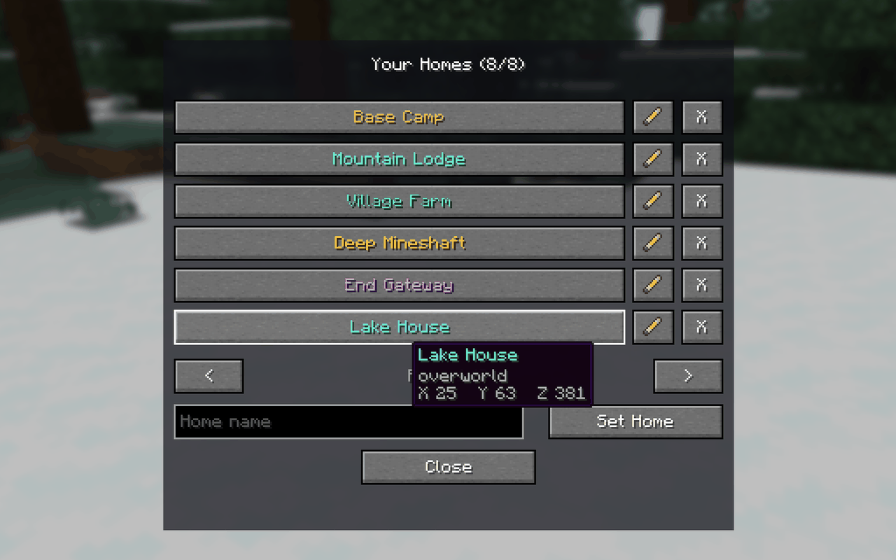
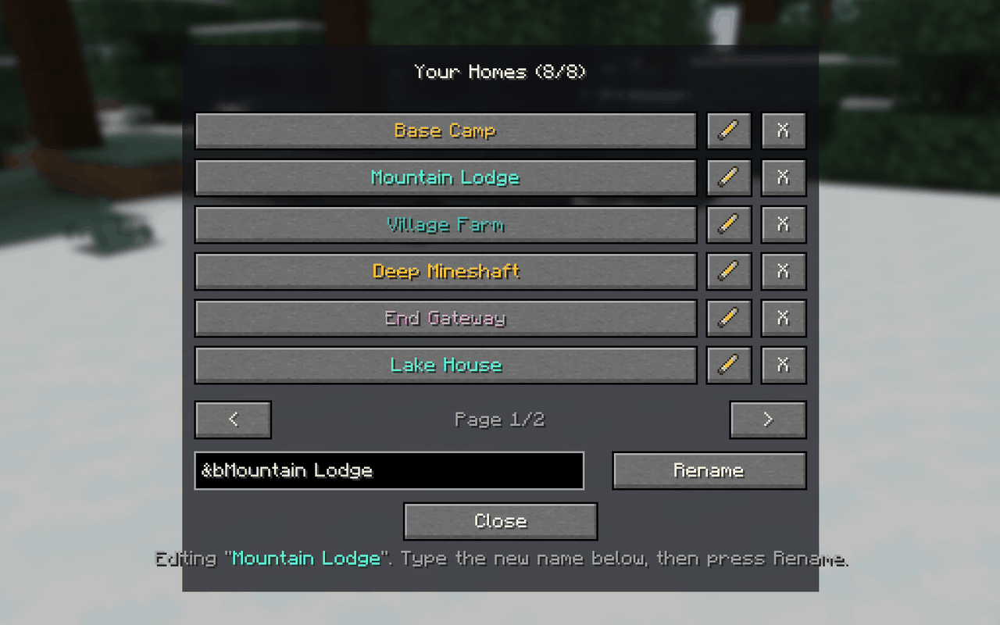
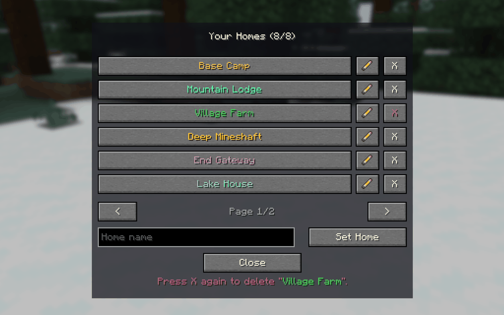
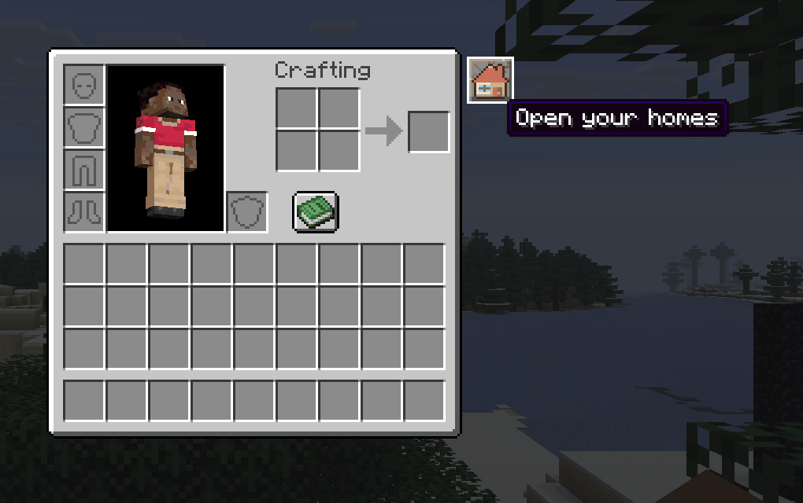
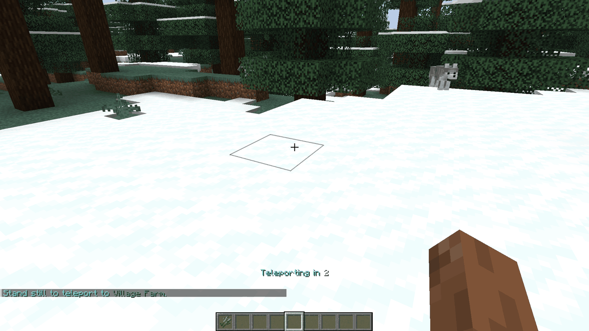
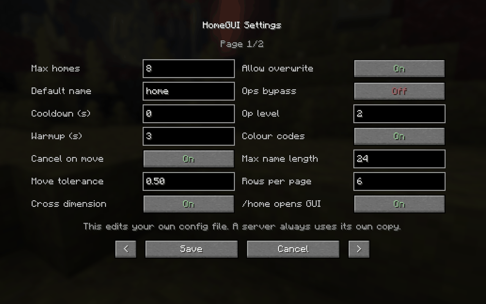
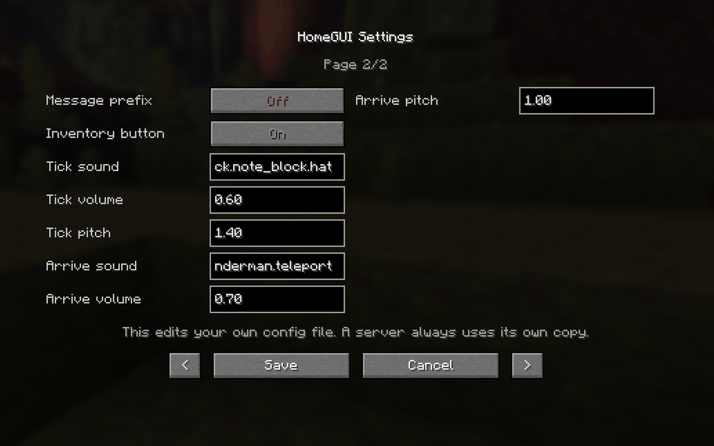

# HomeGUI

> A simple sethome mod with a GUI for Fabric.

HomeGUI is a small Fabric mod for Minecraft 26.2 that lets you save places and return to them from a simple in-game screen. Vanilla clients can still use every command through chat.

## Highlights

- Simple home GUI with rename, delete, and pagination
- Teleport cooldowns, warmups, sounds, and movement cancellation
- Per-player, per-world storage
- English and Vietnamese built in
- Optional Mod Menu integration

## Screenshots

Every home on one screen. Hover a row for its dimension and coordinates.



| Rename in place | Delete with a confirmation |
|---|---|
|  |  |

The house button beside the inventory, and the warmup counting down on the action bar.

| Inventory button | Teleport warmup |
|---|---|
|  |  |

Settings, with Mod Menu installed.

| Page 1 | Page 2 |
|---|---|
|  |  |

## Install

Requires Java 25, Fabric Loader 0.19.3+, and Fabric API.

Install HomeGUI on the server or in single player. The client mod is optional, but required to use the GUI; vanilla clients can still use every command through chat.

## Commands

| Command | Action |
|---|---|
| `/sethome [name]` | Save or replace a home |
| `/home [name]` | Open the GUI or teleport |
| `/delhome [name]` | Delete a home |
| `/homes` | Open or list your homes |
| `/homegui reload` | Reload config and translations |

Home names can contain spaces and colour codes. Use `&` or `§` for the vanilla codes and
`&#RRGGBB` for any other colour; the limit counts visible characters only, and lookups ignore
the markup, so `/home base` still finds a home named `&#55FFAAbase`.

## Configure

Edit `config/homegui.json`, or use **Mods → HomeGUI → Config** with Mod Menu installed.

You can control home limits, cross-dimension travel, cooldowns, warmups, sounds, permissions, GUI size, and more. Translation files live in `src/main/resources/assets/homegui/lang/`.

## Build

```bash
./gradlew build
```

The ready-to-use JAR is created in `build/libs/`.

## License

[MIT](LICENSE) © 2026 Nighter
